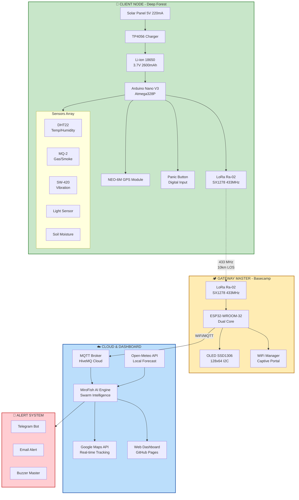
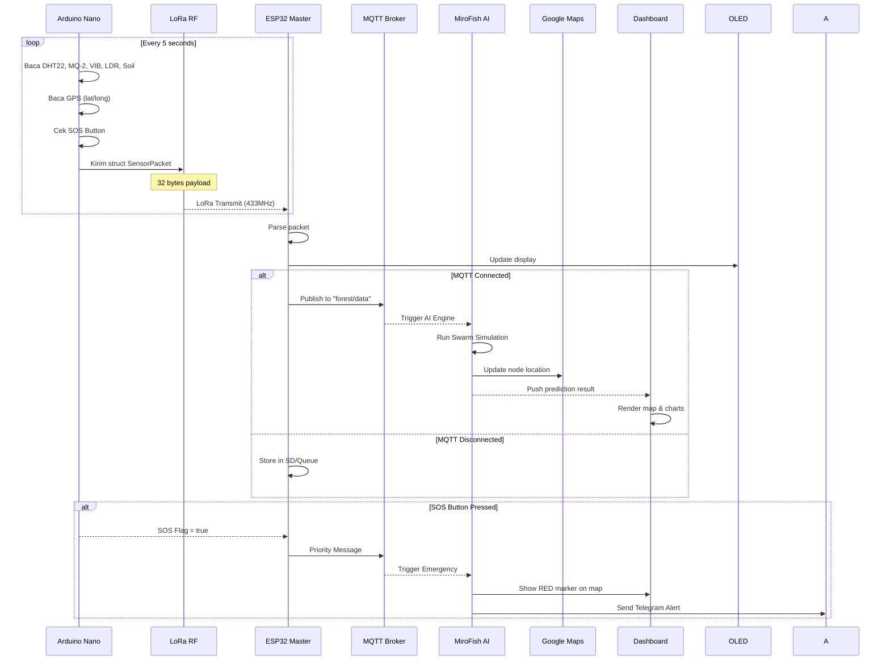
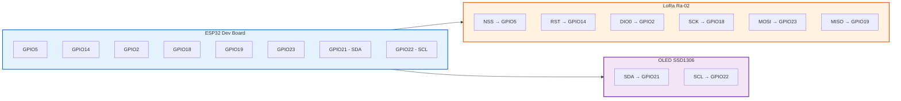
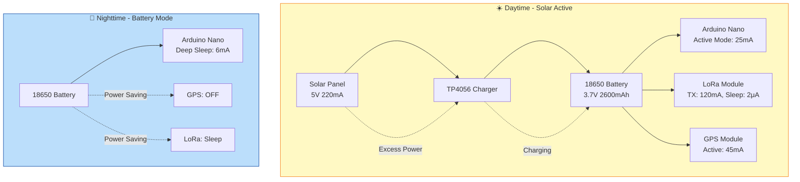
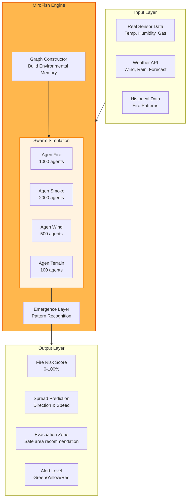
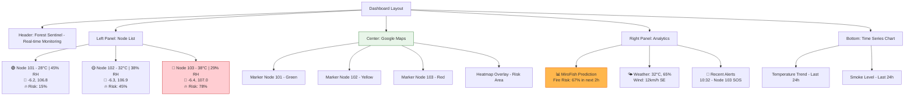
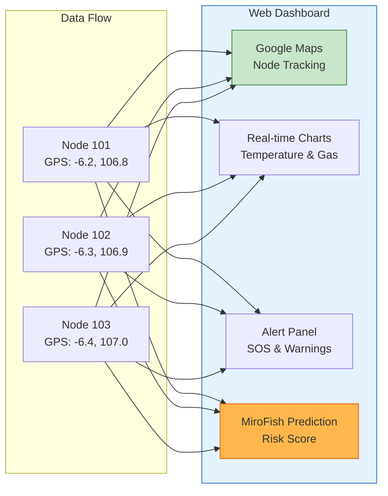
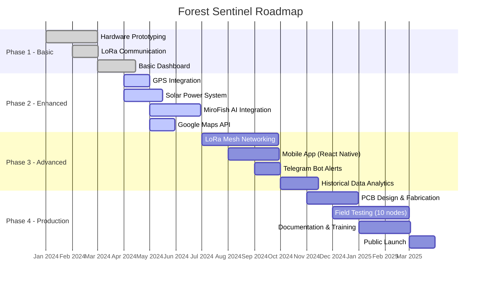

<div align="center">

# 🌲 FOREST SENTINEL: Swarm Intelligence Monitoring System

**Next-Gen Environmental Monitoring & Emergency SAR System powered by LoRa, MiroFish AI, and Solar Energy**

[](https://github.com/ficrammanifur/-Forest-Sentinel-Dashboard)
[](https://www.arduino.cc/)
[](https://www.espressif.com/)
[](https://github.com/666ghj/MiroFish)
[](https://en.wikipedia.org/wiki/Energy_harvesting)
[](https://lora-alliance.org/)
[](https://developers.google.com/maps)

*Sistem deteksi dini kebakaran hutan dan darurat kemanusiaan (SOS) menggunakan **Swarm Intelligence (MiroFish)**, **GPS Tracking**, dan **LoRa Mesh** untuk area tanpa sinyal seluler.*

</div>

---

## 📋 Daftar Isi

- [✨ Overview](#-overview)
- [🎯 Fitur Unggulan](#-fitur-unggulan)
- [🧠 System Architecture](#-system-architecture)
- [🔩 Hardware Components](#-hardware-components)
- [🔌 Wiring Diagram](#-wiring-diagram)
- [📡 Communication Protocol](#-communication-protocol)
- [⚡ Power Management](#-power-management--green-energy)
- [🤖 MiroFish AI Integration](#-mirofish-ai-integration)
- [🗺️ Google Maps Dashboard](#️-google-maps-dashboard)
- [🚀 Quick Start Guide](#-quick-start-guide)
- [📷 Project Preview](#-project-preview)
- [🔧 Troubleshooting](#-troubleshooting)
- [📊 Future Development](#-future-development)
- [📝 License](#-license)

---

## ✨ Overview

**Forest Sentinel** adalah solusi monitoring hutan mandiri yang menggabungkan ketangguhan *hardware* lapangan dengan kecerdasan simulasi digital (MiroFish AI). Sistem ini tidak hanya memantau api, tetapi juga bertindak sebagai **Panic Button (SOS)** bagi orang yang tersesat di hutan, dengan transmisi koordinat GPS secara *real-time* ke dashboard basecamp.

### Mengapa Arduino Nano untuk Client?
- **Efisiensi Daya Ekstrim:** Konsumsi lebih rendah dari ESP32
- **Stabilitas Analog:** ADC lebih bersih untuk sensor MQ-2, Soil Moisture
- **Biaya Efektif:** 1/3 harga ESP32, ideal untuk 100+ node
- **Solar Friendly:** Bekerja sempurna dengan TP4056 + 18650

---

## 🎯 Fitur Unggulan

| Fitur | Deskripsi | Status |
|-------|-----------|--------|
| **Hybrid System** | Arduino Nano (Client) + ESP32 (Master) | ✅ Implemented |
| **MiroFish AI Engine** | Simulasi agen cerdas untuk prediksi risiko | ✅ Implemented |
| **Panic Button SOS** | Tombol darurat dengan GPS tracking | ✅ Implemented |
| **Green Energy** | Solar panel 5V + TP4056 + BMS 18650 | ✅ Implemented |
| **LoRa Mesh** | Komunikasi multi-hop hingga 10km | 🚧 In Progress |
| **Google Maps Integration** | Pelacakan lokasi node real-time | ✅ Implemented |
| **WiFi Manager** | Captive portal untuk konfigurasi mudah | ✅ Implemented |
| **MQTT Bridge** | Koneksi ke broker HiveMQ Cloud | ✅ Implemented |

---

## 🧠 System Architecture

### Diagram Blok Sistem Lengkap



### Alur Data Lengkap



---

## 🔩 Hardware Components

### 📦 **Client Node (The Scout) - Arduino Nano Based**

| Komponen | Spesifikasi | Fungsi | Harga Estimasi |
|----------|-------------|--------|----------------|
| **Arduino Nano V3** | ATmega328P, 16MHz, 32KB Flash | Kontrol utama, pembacaan sensor | Rp 60.000 |
| **LoRa Ra-02** | SX1278, 433MHz, +20dBm | Komunikasi jarak jauh (5-10km) | Rp 120.000 |
| **GPS NEO-6M** | U-blox, 50 channels, 2.5m accuracy | Tracking posisi node | Rp 150.000 |
| **DHT22** | -40~80°C, 0-100% RH | Suhu & kelembaban | Rp 50.000 |
| **MQ-2** | LPG, Smoke, CO (300-10000ppm) | Deteksi asap kebakaran | Rp 35.000 |
| **SW-420** | Digital output, LM393 comparator | Deteksi getaran tanah | Rp 15.000 |
| **Soil Moisture** | Analog, capacitive | Kelembaban tanah | Rp 20.000 |
| **LDR** | 5mm, GL5528 | Intensitas cahaya | Rp 3.000 |
| **Solar Panel** | 5V 220mA (1.1W) | Pengisian daya | Rp 50.000 |
| **TP4056** | 1A charging, overcharge protection | Manajemen baterai | Rp 10.000 |
| **Baterai 18650** | 3.7V 2600mAh, Li-ion | Penyimpanan energi | Rp 50.000 |
| **Push Button** | 6x6x5mm | Tombol SOS | Rp 2.000 |
| **Total** | - | - | **Rp 565.000** |

### 🖥️ **Master Gateway (The Brain) - ESP32 Based**

| Komponen | Spesifikasi | Fungsi |
|----------|-------------|--------|
| **ESP32-WROOM-32** | Dual-core Xtensa LX6, 520KB SRAM | Gateway utama, WiFi, FreeRTOS |
| **LoRa Ra-02** | SX1278, 433MHz | Penerima data dari client |
| **OLED SSD1306** | 128x64, I2C | Status display (IP, MQTT, Node count) |
| **LED RGB** | Common cathode | Indikator status |

---

## 🔌 Wiring Diagram

### Client Node (Arduino Nano)

```mermaid
graph LR
    subgraph NANO[Arduino Nano V3]
        direction TB
        A0[Analog Pin A0]
        A1[Analog Pin A1]
        A2[Analog Pin A2]
        A3[Analog Pin A3]
        D2[Digital Pin 2]
        D3[Digital Pin 3]
        D4[Digital Pin 4]
        D5[Digital Pin 5]
        D9[Digital Pin 9]
        D10[Digital Pin 10]
        D11[Digital Pin 11]
        D12[Digital Pin 12]
        D13[Digital Pin 13]
        5V[5V Output]
        GND[GND]
    end

    subgraph SENSORS[Sensors]
        DHT22[DHT22<br>Data → D4]
        MQ2[MQ-2<br>Analog → A0]
        VIB[SW-420<br>DO → D3]
        LDR[LDR<br>Analog → A1]
        SOIL[Soil Moisture<br>Analog → A2]
        GPS[GPS NEO-6M<br>TX → D2, RX → D3]
        SOS[Push Button<br>D5 → GND]
    end

    subgraph LORA[LoRa Ra-02]
        NSS[NSS → D10]
        SCK[SCK → D13]
        MOSI[MOSI → D11]
        MISO[MISO → D12]
        RST[RST → D9]
        DIO0[DIO0 → D2]
    end

    subgraph POWER[Power System]
        SOLAR[Solar Panel 5V]
        TP4056[TP4056<br>IN+ → Solar+<br>IN- → Solar-<br>BAT+ → 18650+<br>BAT- → 18650-]
        BATT[18650 3.7V<br>+ → Nano VIN<br>- → Nano GND]
    end

    NANO --> SENSORS
    NANO --> LORA
    POWER --> NANO

    style NANO fill:#e3f2fd,stroke:#1565c0,stroke-width:2px
    style SENSORS fill:#c8e6c9,stroke:#2e7d32,stroke-width:2px
    style LORA fill:#fff3e0,stroke:#e65100,stroke-width:2px
    style POWER fill:#ffcdd2,stroke:#c62828,stroke-width:2px
```



### Master Gateway (ESP32)



---

## 📡 Communication Protocol

### LoRa Packet Structure (32 bytes)

```cpp
struct SensorPacket {
    float temperature;    // 4 bytes: -40°C to 80°C
    float humidity;       // 4 bytes: 0% to 100%
    int gas;             // 4 bytes: 0-1023 (analog)
    int light;           // 4 bytes: 0-1023
    int soil;            // 4 bytes: 0-1023
    int vibration;       // 4 bytes: 0 or 1
    bool sos;            // 1 byte: true/false
    uint32_t nodeID;     // 4 bytes: 1-255
    float latitude;      // 4 bytes: -90 to 90
    float longitude;     // 4 bytes: -180 to 180
    // Total: 33 bytes (with padding)
} __attribute__((packed));
```

### LoRa Configuration

| Parameter | Value | Keterangan |
|-----------|-------|------------|
| Frequency | 433 MHz | Frekuensi LoRa Ra-02 |
| Spreading Factor | SF12 | Maximum range |
| Bandwidth | 125 kHz | Standard LoRa |
| Coding Rate | 4/5 | Error correction |
| TX Power | +20 dBm | Maksimum power |
| Range (LOS) | 5-10 km | Line of sight |
| Payload Size | 32 bytes | Struktur SensorPacket |

### MQTT Topic Structure

| Topic | Direction | Payload | Description |
|-------|-----------|---------|-------------|
| `forest/data` | Client → Broker | JSON | Data sensor normal |
| `forest/sos` | Client → Broker | JSON | Emergency priority |
| `forest/command` | Broker → Client | JSON | Command to node |
| `forest/status` | Client → Broker | JSON | Node health |

---

## ⚡ Power Management & Green Energy

### Solar Power System Diagram



### Power Consumption Profile

| Mode | Arduino Nano | LoRa | GPS | Total | Duration | Frequency |
|------|-------------|------|-----|------|----------|-----------|
| **Active Reading** | 25 mA | 2 μA (sleep) | 45 mA | 70 mA | 2s | Every 5s |
| **LoRa Transmit** | 25 mA | 120 mA | 45 mA | 190 mA | 500ms | Every 5s |
| **Deep Sleep** | 6 mA | 2 μA | OFF | 6 mA | 2.5s | Every 5s |
| **Average** | - | - | - | **~12 mA** | - | - |

### Battery Life Calculation

```
Battery Capacity: 2600 mAh (18650 Li-ion)
Daily Consumption: 12 mA × 24h = 288 mAh/day
Solar Input: 220mA × 6h (effective) = 1320 mAh/day

Net Gain: +1032 mAh/day (battery will maintain full charge)
Battery-only Runtime: 2600 / 12 ≈ 216 hours ≈ 9 days

Conclusion: Dengan solar panel, sistem dapat beroperasi INDEFINITELY
```

---

## 🤖 MiroFish AI Integration

### Apa itu MiroFish?

**MiroFish** adalah mesin kecerdasan berbasis *multi-agent technology* yang mensimulasikan perilaku swarm (kawanan) untuk memprediksi skenario bencana. Sistem ini bekerja dengan prinsip:

1. **Graph Building:** Mengumpulkan semua data sensor dari seluruh node menjadi memori kolektif
2. **Swarm Simulation:** Menjalankan ribuan agen cerdas (masing-masing dengan perilaku unik) untuk mensimulasikan penyebaran api, asap, dan respons lingkungan
3. **Emergent Prediction:** Dari interaksi antar agen, muncul pola prediksi yang akurat
4. **Report Generation:** Menghasilkan laporan risiko berbasis narasi alam

### Arsitektur MiroFish



### Integrasi MiroFish dengan Dashboard

```javascript
// MiroFish API Endpoint (contoh)
const mirofishEndpoint = "https://api.mirofish.ai/v1/predict";

async function getFireRisk(nodeData, weatherData) {
    const response = await fetch(mirofishEndpoint, {
        method: "POST",
        headers: { "Content-Type": "application/json" },
        body: JSON.stringify({
            sensors: {
                temperature: nodeData.temp,
                humidity: nodeData.hum,
                gas: nodeData.gas,
                soil_moisture: nodeData.soil
            },
            weather: {
                wind_speed: weatherData.wind_speed,
                wind_direction: weatherData.wind_dir,
                rain_1h: weatherData.rain,
                forecast: weatherData.forecast
            },
            location: {
                lat: nodeData.lat,
                lng: nodeData.lng,
                terrain: "forest"
            }
        })
    });
    
    const prediction = await response.json();
    return {
        fire_risk: prediction.risk_score,      // 0-100
        spread_direction: prediction.direction, // degrees
        spread_speed: prediction.speed_kmh,     // km/h
        alert_level: prediction.alert           // "GREEN", "YELLOW", "RED"
    };
}
```

---

## 🗺️ Google Maps Dashboard

### Dashboard Features

| Feature | Description | Technology |
|---------|-------------|------------|
| **Real-time Node Tracking** | Semua node muncul sebagai marker dengan warna sesuai status | Google Maps JavaScript API |
| **SOS Panic Mode** | Marker berubah menjadi merah dan berkedip saat SOS ditekan | Custom overlay |
| **Heatmap Layer** | Visualisasi risiko kebakaran berdasarkan MiroFish prediction | Heatmap Layer API |
| **Path Prediction** | Animasi arah penyebaran api | Polyline + Animation |
| **Weather Overlay** | Data cuaca real-time dari Open-Meteo | Weather layer |
| **Node Details Popup** | Klik marker untuk lihat data sensor lengkap | InfoWindow |

### Dashboard Preview Structure



### Live Dashboard URL

👉 **https://ficrammanifur.github.io/-Forest-Sentinel-Dashboard/**

Dashboard ini di-host di GitHub Pages dan terhubung ke:
- MQTT Broker (HiveMQ Cloud) untuk data real-time
- MiroFish API untuk prediksi AI
- Open-Meteo API untuk data cuaca
- Google Maps JS API untuk visualisasi

---

## 🚀 Quick Start Guide

### Prerequisites

| Component | Requirement |
|-----------|-------------|
| **Arduino IDE** | 1.8.19+ with ESP32 board package |
| **Libraries** | LoRa, DHT, Adafruit_SSD1306, WiFiManager, PubSubClient |
| **Hardware** | Arduino Nano + ESP32 + LoRa modules |
| **Network** | WiFi for ESP32 Master |
| **MQTT Account** | Free HiveMQ Cloud account |

### 1️⃣ Setup Client Node (Arduino Nano)

```bash
# 1. Install Library di Arduino IDE
#   - LoRa by Sandeep Mistry
#   - DHT sensor library by Adafruit
#   - ArduinoJson by Benoit Blanchon

# 2. Upload kode ke Arduino Nano
#   - Board: Arduino Nano
#   - Processor: ATmega328P (Old Bootloader)
#   - Port: (sesuaikan dengan COM/serial kamu)

# 3. Buka Serial Monitor (115200 baud)
```

**Kode Client Nano Lengkap:**

```cpp
#include <SPI.h>
#include <LoRa.h>
#include <DHT.h>
#include <SoftwareSerial.h>
#include <TinyGPS++.h>

// ===== PIN CONFIGURATION =====
// LoRa
#define SCK 13
#define MISO 12
#define MOSI 11
#define SS 10
#define RST 9
#define DIO0 2

// Sensors
#define DHTPIN 4
#define DHTTYPE DHT22
#define GAS_PIN A0
#define LDR_PIN A1
#define SOIL_PIN A2
#define VIB_PIN 3
#define SOS_BUTTON 5

// GPS
#define GPS_RX 2  // GPS TX ke Nano RX (pin 2)
#define GPS_TX 3  // GPS RX ke Nano TX (pin 3)

// ===== OBJECTS =====
DHT dht(DHTPIN, DHTTYPE);
SoftwareSerial gpsSerial(GPS_RX, GPS_TX);
TinyGPSPlus gps;

// ===== STRUCTURE =====
struct SensorPacket {
    float temperature;
    float humidity;
    int gas;
    int light;
    int soil;
    int vibration;
    bool sos;
    uint32_t nodeID;
    float latitude;
    float longitude;
} __attribute__((packed));

// ===== CONFIGURATION =====
const uint32_t NODE_ID = 101;
const unsigned long SEND_INTERVAL = 5000;  // 5 detik
unsigned long lastSend = 0;

void setup() {
    Serial.begin(115200);
    dht.begin();
    pinMode(VIB_PIN, INPUT_PULLUP);
    pinMode(SOS_BUTTON, INPUT_PULLUP);
    
    // GPS Serial
    gpsSerial.begin(9600);
    
    // Inisialisasi LoRa
    Serial.println("[INFO] Initializing LoRa...");
    LoRa.setPins(SS, RST, DIO0);
    
    if (!LoRa.begin(433E6)) {
        Serial.println("[ERROR] LoRa init failed!");
        while (1);
    }
    
    // Konfigurasi LoRa untuk range maksimum
    LoRa.setSpreadingFactor(12);
    LoRa.setSignalBandwidth(125E3);
    LoRa.setCodingRate4(5);
    LoRa.setTxPower(20, true);
    
    Serial.println("[INFO] LoRa Ready!");
    Serial.print("[INFO] Node ID: "); Serial.println(NODE_ID);
}

void loop() {
    unsigned long now = millis();
    
    if (now - lastSend >= SEND_INTERVAL) {
        SensorPacket data;
        
        // 1. Baca Sensor
        data.temperature = dht.readTemperature();
        data.humidity = dht.readHumidity();
        data.gas = analogRead(GAS_PIN);
        data.light = analogRead(LDR_PIN);
        data.soil = analogRead(SOIL_PIN);
        data.vibration = digitalRead(VIB_PIN);
        data.sos = (digitalRead(SOS_BUTTON) == LOW);
        data.nodeID = NODE_ID;
        
        // 2. Baca GPS (jika ada fix)
        while (gpsSerial.available() > 0) {
            gps.encode(gpsSerial.read());
        }
        
        if (gps.location.isValid()) {
            data.latitude = gps.location.lat();
            data.longitude = gps.location.lng();
        } else {
            data.latitude = 0;
            data.longitude = 0;
        }
        
        // 3. Kirim via LoRa
        LoRa.beginPacket();
        LoRa.write((uint8_t*)&data, sizeof(data));
        LoRa.endPacket();
        
        // 4. Log ke Serial
        Serial.println("=================================");
        Serial.println("[SENT] Sensor Packet");
        Serial.print("  Node ID: "); Serial.println(data.nodeID);
        Serial.print("  Temp: "); Serial.print(data.temperature); Serial.println(" °C");
        Serial.print("  Humidity: "); Serial.print(data.humidity); Serial.println(" %");
        Serial.print("  Gas: "); Serial.println(data.gas);
        Serial.print("  Soil: "); Serial.println(data.soil);
        Serial.print("  Vibration: "); Serial.println(data.vibration);
        Serial.print("  SOS: "); Serial.println(data.sos ? "ACTIVE" : "OFF");
        Serial.print("  GPS: "); 
        if (data.latitude != 0) {
            Serial.print(data.latitude, 6);
            Serial.print(", ");
            Serial.println(data.longitude, 6);
        } else {
            Serial.println("No Fix");
        }
        Serial.println("=================================");
        
        lastSend = now;
    }
    
    // Delay kecil untuk stabilitas
    delay(10);
}
```

### 2️⃣ Setup Master Gateway (ESP32)

```bash
# 1. Install ESP32 Board Package
#   File -> Preferences -> Board Manager URLs
#   Tambahkan: https://raw.githubusercontent.com/espressif/arduino-esp32/gh-pages/package_esp32_index.json

# 2. Install Libraries
#   - LoRa by Sandeep Mistry
#   - WiFiManager by tzapu
#   - PubSubClient by Nick O'Leary
#   - Adafruit SSD1306 by Adafruit

# 3. Upload kode ke ESP32
#   - Board: ESP32 Dev Module
#   - Partition Scheme: No OTA (Large APP)
#   - Port: (sesuaikan)
```

**Kode Master ESP32 Lengkap:**

```cpp
#include <WiFi.h>
#include <WiFiManager.h>
#include <PubSubClient.h>
#include <ArduinoJson.h>
#include <SPI.h>
#include <LoRa.h>
#include <Wire.h>
#include <Adafruit_GFX.h>
#include <Adafruit_SSD1306.h>

// ===== OLED CONFIGURATION =====
#define SCREEN_WIDTH 128
#define SCREEN_HEIGHT 64
#define OLED_RESET -1
#define SCREEN_ADDRESS 0x3C
Adafruit_SSD1306 display(SCREEN_WIDTH, SCREEN_HEIGHT, &Wire, OLED_RESET);

// ===== LORA PINS =====
#define SS 5
#define RST 14
#define DIO0 2

// ===== MQTT CONFIGURATION =====
const char* MQTT_SERVER = "broker.hivemq.com";
const int MQTT_PORT = 1883;
const char* MQTT_TOPIC = "forest/data";
const char* MQTT_TOPIC_SOS = "forest/sos";

// ===== STRUCTURE (harus sama dengan Client) =====
struct SensorPacket {
    float temperature;
    float humidity;
    int gas;
    int light;
    int soil;
    int vibration;
    bool sos;
    uint32_t nodeID;
    float latitude;
    float longitude;
} __attribute__((packed));

// ===== GLOBAL VARIABLES =====
WiFiClient espClient;
PubSubClient client(espClient);
QueueHandle_t dataQueue;
int packetCount = 0;
unsigned long lastStatsTime = 0;

// ===== OLED UPDATE FUNCTION =====
void updateOLED(String status, String ip, bool mqttConnected, int nodes) {
    display.clearDisplay();
    display.setTextSize(1);
    display.setTextColor(SSD1306_WHITE);
    
    display.setCursor(0, 0);
    display.println("FOREST SENTINEL");
    display.println("----------------");
    
    display.print("Status: ");
    display.println(status);
    
    display.print("IP: ");
    display.println(ip.substring(0, 15));
    
    display.print("MQTT: ");
    display.println(mqttConnected ? "CONNECTED" : "DISCONNECT");
    
    display.print("Nodes: ");
    display.println(nodes);
    
    display.print("Pkts: ");
    display.println(packetCount);
    
    display.display();
}

// ===== MQTT CALLBACK =====
void mqttCallback(char* topic, byte* payload, unsigned int length) {
    Serial.print("[MQTT] Message arrived on topic: ");
    Serial.println(topic);
}

// ===== MQTT RECONNECT =====
void reconnectMQTT() {
    while (!client.connected()) {
        String clientId = "ForestMaster-" + String(random(0xffff), HEX);
        
        if (client.connect(clientId.c_str())) {
            Serial.println("[MQTT] Connected!");
            client.subscribe("forest/command");
            updateOLED("Running", WiFi.localIP().toString(), true, packetCount);
        } else {
            Serial.print("[MQTT] Failed, rc=");
            Serial.print(client.state());
            Serial.println(" retrying in 5s");
            updateOLED("MQTT Fail", WiFi.localIP().toString(), false, packetCount);
            delay(5000);
        }
    }
}

// ===== TASK LORA (Core 0 - Priority 2) =====
void taskLoRa(void *pvParameters) {
    SensorPacket receivedData;
    
    while(1) {
        int packetSize = LoRa.parsePacket();
        
        if (packetSize == sizeof(SensorPacket)) {
            LoRa.readBytes((uint8_t*)&receivedData, sizeof(receivedData));
            
            // Kirim ke queue
            if (xQueueSend(dataQueue, &receivedData, 0) != pdTRUE) {
                Serial.println("[WARN] Queue full!");
            } else {
                packetCount++;
                Serial.print("[LoRa] Received from node ");
                Serial.println(receivedData.nodeID);
            }
        }
        
        vTaskDelay(pdMS_TO_TICKS(10));
    }
}

// ===== TASK MQTT (Core 1 - Priority 1) =====
void taskMQTT(void *pvParameters) {
    SensorPacket packet;
    StaticJsonDocument<512> doc;
    char buffer[512];
    
    while(1) {
        if (xQueueReceive(dataQueue, &packet, portMAX_DELAY) == pdTRUE) {
            if (client.connected()) {
                // Buat JSON payload
                doc.clear();
                doc["node_id"] = packet.nodeID;
                doc["temperature"] = packet.temperature;
                doc["humidity"] = packet.humidity;
                doc["gas"] = packet.gas;
                doc["light"] = packet.light;
                doc["soil"] = packet.soil;
                doc["vibration"] = packet.vibration;
                doc["sos"] = packet.sos;
                doc["latitude"] = packet.latitude;
                doc["longitude"] = packet.longitude;
                doc["timestamp"] = millis();
                
                // Serialize JSON
                size_t n = serializeJson(doc, buffer);
                
                // Pilih topic berdasarkan SOS
                const char* topic = packet.sos ? MQTT_TOPIC_SOS : MQTT_TOPIC;
                
                // Publish ke MQTT
                if (client.publish(topic, buffer, n)) {
                    Serial.print("[MQTT] Published to ");
                    Serial.println(topic);
                } else {
                    Serial.println("[MQTT] Publish failed!");
                }
            }
        }
    }
}

void setup() {
    Serial.begin(115200);
    
    // ===== INIT OLED =====
    if(!display.begin(SSD1306_SWITCHCAPVCC, SCREEN_ADDRESS)) {
        Serial.println(F("[ERROR] SSD1306 allocation failed"));
    }
    display.clearDisplay();
    display.display();
    
    // ===== WIFI MANAGER =====
    WiFiManager wm;
    updateOLED("Config Portal", "192.168.4.1", false, 0);
    
    // AutoConnect dengan AP name "ForestSentinel_Master"
    if (!wm.autoConnect("ForestSentinel_Master")) {
        Serial.println("[ERROR] Failed to connect WiFi");
        ESP.restart();
    }
    
    String ipAddress = WiFi.localIP().toString();
    Serial.print("[WiFi] Connected! IP: ");
    Serial.println(ipAddress);
    
    // ===== MQTT SETUP =====
    client.setServer(MQTT_SERVER, MQTT_PORT);
    client.setCallback(mqttCallback);
    
    // ===== LORA SETUP =====
    LoRa.setPins(SS, RST, DIO0);
    if (!LoRa.begin(433E6)) {
        Serial.println("[ERROR] LoRa init failed!");
        updateOLED("LoRa Error", ipAddress, false, 0);
        while(1);
    }
    
    // Konfigurasi LoRa
    LoRa.setSpreadingFactor(12);
    LoRa.setSignalBandwidth(125E3);
    LoRa.setCodingRate4(5);
    
    Serial.println("[LoRa] Ready on 433MHz");
    
    // ===== QUEUE & TASKS =====
    dataQueue = xQueueCreate(50, sizeof(SensorPacket));
    
    xTaskCreatePinnedToCore(
        taskLoRa, 
        "LoRaTask", 
        8192, 
        NULL, 
        2, 
        NULL, 
        0
    );
    
    xTaskCreatePinnedToCore(
        taskMQTT, 
        "MQTTTask", 
        8192, 
        NULL, 
        1, 
        NULL, 
        1
    );
    
    updateOLED("Running", ipAddress, false, 0);
    Serial.println("[SYSTEM] Ready!");
}

void loop() {
    // Maintain MQTT connection
    if (!client.connected()) {
        reconnectMQTT();
    }
    client.loop();
    
    // Update OLED stats setiap 5 detik
    if (millis() - lastStatsTime > 5000) {
        updateOLED("Running", WiFi.localIP().toString(), client.connected(), packetCount);
        lastStatsTime = millis();
    }
    
    vTaskDelay(pdMS_TO_TICKS(100));
}
```

### 3️⃣ Setup Dashboard

Dashboard sudah di-host di GitHub Pages, tidak perlu deploy sendiri.

**URL:** https://ficrammanifur.github.io/-Forest-Sentinel-Dashboard/

Dashboard ini akan otomatis:
- Connect ke MQTT Broker (HiveMQ)
- Subscribe ke topic `forest/data` dan `forest/sos`
- Render Google Maps dengan marker semua node
- Tampilkan data sensor real-time
- Integrasi dengan MiroFish AI (via API)

### 4️⃣ Testing

```bash
# 1. Power on Client Node (Arduino Nano)
#    - LED LoRa akan berkedip saat transmit
#    - Serial monitor akan menampilkan data

# 2. Power on Master Gateway (ESP32)
#    - Cari WiFi "ForestSentinel_Master"
#    - Connect dan masuk ke 192.168.4.1
#    - Masukkan WiFi credentials rumah/kantor

# 3. Buka Dashboard
#    - https://ficrammanifur.github.io/-Forest-Sentinel-Dashboard/
#    - Node akan muncul di Google Maps

# 4. Test SOS
#    - Tekan tombol SOS pada Client Node
#    - Marker di dashboard akan berubah merah
#    - Alert akan muncul di panel notifikasi
```

---

## 📷 Project Preview

### Hardware Assembly

<div align="center">
<table>
<tr>
<td align="center">

<br/>
<em>Client Node - Arduino Nano + LoRa + GPS + Solar</em>
</td>
</tr>
</table>
</div>

### Dashboard Preview

<div align="center">
<table>
<tr>
<td align="center">

<br/>
<em>Forest Sentinel Dashboard - Google Maps Integration</em>
</td>
</tr>
</table>
</div>

### Real-time Monitoring Features



---

## 🔧 Troubleshooting

### Common Issues & Solutions

| Problem | Possible Cause | Solution |
|---------|---------------|----------|
| **LoRa tidak konek** | Frekuensi mismatch | Pastikan Client dan Master sama-sama 433MHz |
| | Antenna tidak terpasang | Pasang antenna helical atau monopole |
| | Jarak terlalu jauh | Pindah closer atau naikkan SF ke 12 |
| **GPS No Fix** | Outdoor visibility | Pindah ke area terbuka |
| | Cold start | Tunggu 5-10 menit pertama kali |
| | Antenna GPS | Pastikan antenna menghadap ke langit |
| **ESP32 tidak connect WiFi** | Wrong credentials | Reset WiFi Manager (hold button 10s) |
| | Signal weak | Pindah lebih dekat ke router |
| **MQTT disconnected** | No internet | Cek koneksi WiFi ESP32 |
| | Broker down | Cek status HiveMQ |
| **Dashboard no data** | MQTT topic mismatch | Cek topic di ESP32 = "forest/data" |
| | CORS issue | Dashboard sudah handle CORS |
| **Battery cepat habis** | GPS always on | GPS hanya aktif 2s per cycle |
| | LoRa power high | Kurangi TX power ke 17dBm |
| | Deep sleep not working | Cek kode delay vs deep sleep |

### Debug Commands

```cpp
// Serial Monitor Commands (ESP32)
// Kirim via Serial Monitor dengan baud 115200

"status"    -> Tampilkan status sistem (WiFi, MQTT, LoRa, Queue)
"reset"     -> Restart ESP32
"clear"     -> Reset packet counter
"nodes"     -> Tampilkan semua node yang pernah terdeteksi

// Contoh output:
>>> status
WiFi: Connected (192.168.1.100)
MQTT: Connected (broker.hivemq.com)
LoRa: Active (433MHz, SF12)
Queue: 5/50 packets
Total packets: 127
Last node: 101
```

---

## 📊 Future Development

### Roadmap 2024-2025



### Planned Features

| Priority | Feature | Description | Target |
|----------|---------|-------------|--------|
| 🔴 **High** | LoRa Mesh Networking | Multi-hop untuk jangkauan lebih luas | Q3 2024 |
| 🔴 **High** | Mobile App | React Native untuk notifikasi push | Q3 2024 |
| 🟡 **Medium** | Telegram Bot | Alert otomatis ke group Telegram | Q4 2024 |
| 🟡 **Medium** | Historical Analytics | Trend analysis dan reporting | Q4 2024 |
| 🟡 **Medium** | Multiple Gateways | Redundancy dan coverage area lebih luas | Q1 2025 |
| 🟢 **Low** | Custom PCB | Miniaturisasi dan降低成本 | Q1 2025 |
| 🟢 **Low** | LoRaWAN Gateway | Integrasi dengan The Things Network | Q2 2025 |

---

## 📝 License

<div align="center">

```
MIT License

Copyright (c) 2024-2025 Forest Sentinel Team

Permission is hereby granted, free of charge, to any person obtaining a copy
of this software and associated documentation files (the "Software"), to deal
in the Software without restriction, including without limitation the rights
to use, copy, modify, merge, publish, distribute, sublicense, and/or sell
copies of the Software, and to permit persons to whom the Software is
furnished to do so, subject to the following conditions:

The above copyright notice and this permission notice shall be included in all
copies or substantial portions of the Software.

THE SOFTWARE IS PROVIDED "AS IS", WITHOUT WARRANTY OF ANY KIND, EXPRESS OR
IMPLIED, INCLUDING BUT NOT LIMITED TO THE WARRANTIES OF MERCHANTABILITY,
FITNESS FOR A PARTICULAR PURPOSE AND NONINFRINGEMENT. IN NO EVENT SHALL THE
AUTHORS OR COPYRIGHT HOLDERS BE LIABLE FOR ANY CLAIM, DAMAGES OR OTHER
LIABILITY, WHETHER IN AN ACTION OF CONTRACT, TORT OR OTHERWISE, ARISING FROM,
OUT OF OR IN CONNECTION WITH THE SOFTWARE OR THE USE OR OTHER DEALINGS IN THE
SOFTWARE.

```

[](LICENSE)

</div>

---

## 👥 Team & Contributors

<div align="center">

| Role | Name | Contact |
|------|------|---------|
| **Project Lead & Hardware Engineer** | Ficram Manifur | [@ficrammanifur](https://github.com/ficrammanifur) |
| **AI/ML Engineer (MiroFish)** | - | - |
| **Frontend Developer** | - | - |
| **Backend & MQTT** | - | - |
| **Field Tester** | - | - |

</div>

---

## 🙏 Acknowledgments

- **MiroFish AI Team** - Swarm intelligence engine for environmental prediction
- **Google Maps Platform** - Real-time mapping and location services
- **HiveMQ** - Free MQTT cloud broker
- **Open-Meteo** - Free weather API
- **Espressif** - ESP32 platform
- **Arduino Community** - Libraries and support

---

## 📞 Contact & Support

- **GitHub Issues:** [Report Bug](https://github.com/ficrammanifur/-Forest-Sentinel-Dashboard/issues)
- **Email:** forest.sentinel@example.com
- **Demo:** https://ficrammanifur.github.io/-Forest-Sentinel-Dashboard/

---

<div align="center">

╔══════════════════════════════════════════════════════════════════════════════════╗
║                                                                                  ║
║     🌲 FOREST SENTINEL - Swarm Intelligence Monitoring System                    ║
║                   Arduino Nano + ESP32 + LoRa + MiroFish AI                      ║
║                                                                                  ║
║     ⭐ Star us on GitHub! · 🐛 Report Bug · 📫 Request Feature                   ║
║                                                                                  ║
╚══════════════════════════════════════════════════════════════════════════════════╝


**Built with ❤️ for forest conservation and emergency response | Version 2.0.0 | Last Updated: 14 Apr 2026**

<p><a href="#top">⬆ Back to Top</a></p>

</div>
