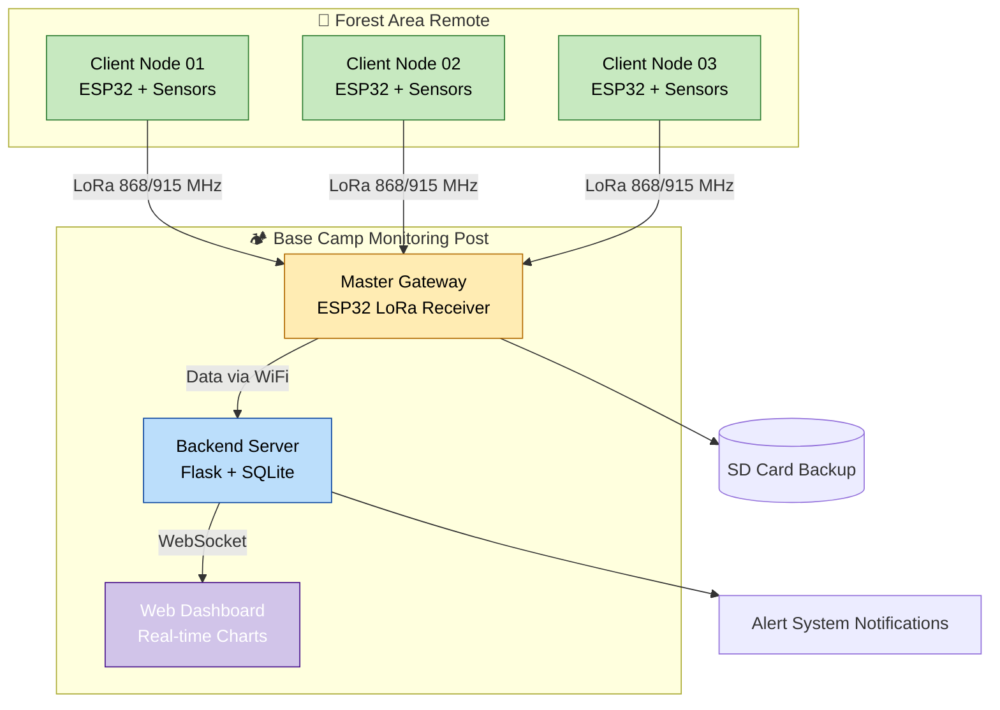
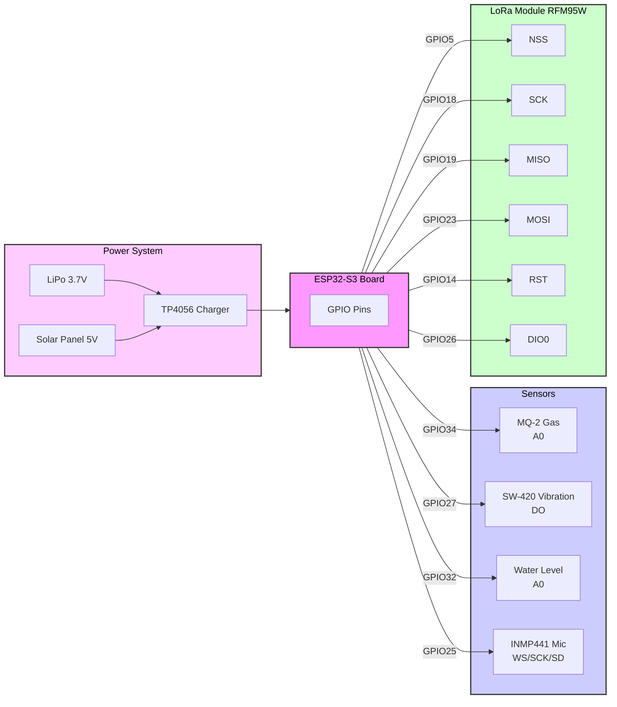
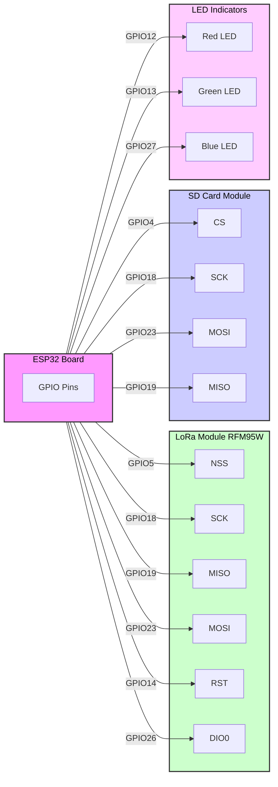
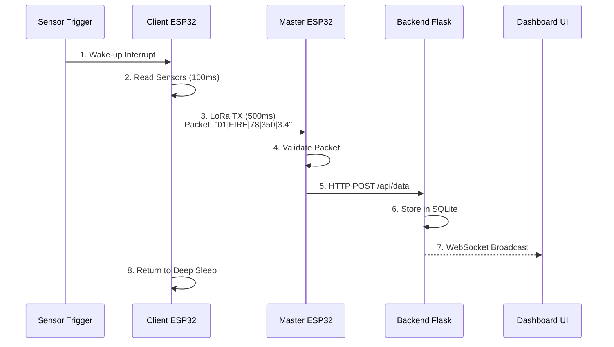
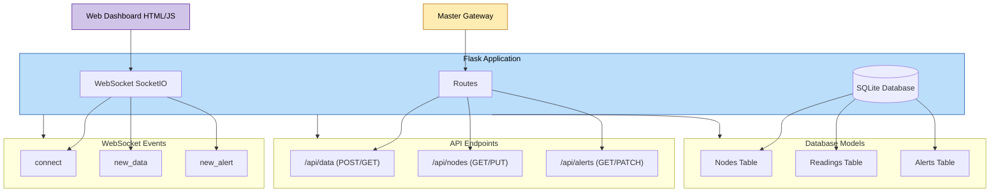
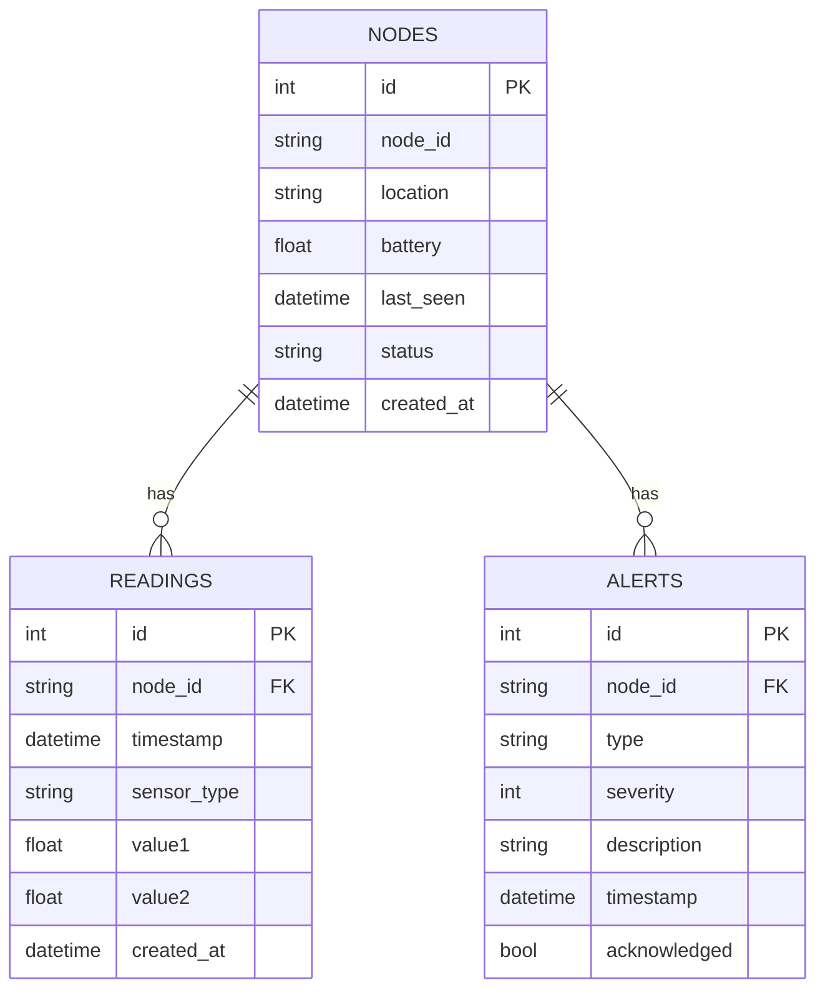
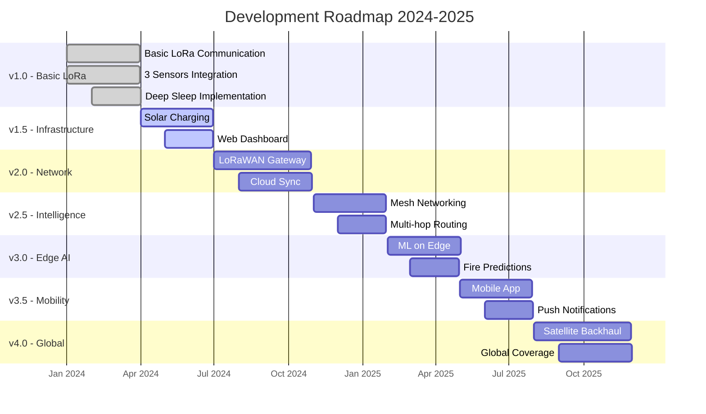
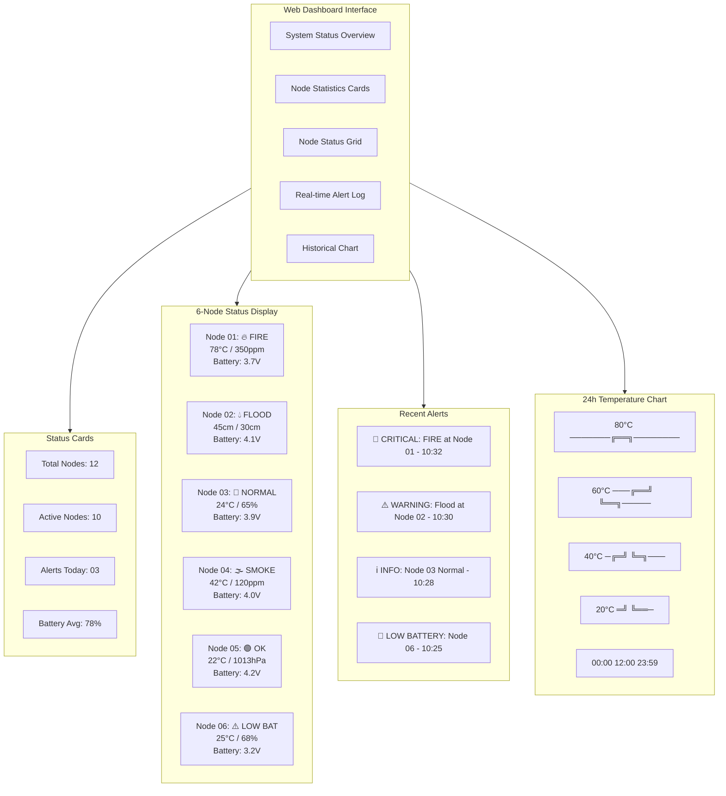
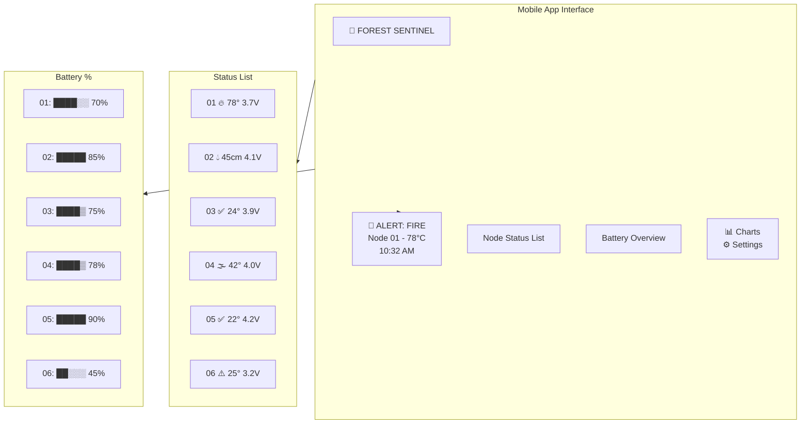

<div align="center">

# 🌲 FOREST SENTINEL LORA SYSTEM

**Long-Range Wireless Environmental Monitoring & Emergency Detection for Remote Forest Areas**

[](https://github.com/forest-sentinel/lora-system)
[](https://cplusplus.com/)
[](https://www.espressif.com/)
[](https://lora-alliance.org/)
[](https://flask.palletsprojects.com/)
[](https://docs.espressif.com/projects/esp-idf/en/latest/esp32/api-reference/system/sleep_modes.html)
[](LICENSE)

*Sistem monitoring darurat berbasis LoRa untuk deteksi dini kebakaran hutan, banjir, dan aktivitas seismik di area terpencil tanpa internet*

</div>

---

## 📑 Daftar Isi

<div align="center">

[✨ Overview](#-overview) • [🧠 System Architecture](#-system-architecture) • [🔩 Hardware](#-hardware-components) • [🔌 Wiring](#-wiring-diagram) • [📡 Communication](#-communication-flow) • [⚡ Power](#-power-management-strategy) • [💻 Backend](#-backend-architecture) • [🚀 How To Run](#-how-to-run) • [📊 Future](#-future-development) • [📷 Preview](#-project-preview)

</div>

---

## ✨ Overview

**Forest Sentinel** adalah sistem monitoring lingkungan mandiri yang dirancang khusus untuk **area hutan terpencil** tanpa akses internet. Sistem ini menggabungkan teknologi **LoRa** untuk komunikasi jarak jauh (hingga 10km) dengan strategi **deep sleep** ultra-hemat daya yang memungkinkan operasi berbulan-bulan hanya dengan baterai.

### 🎯 **Tujuan Utama**
- 🔥 Deteksi dini kebakaran hutan melalui sensor asap dan suhu
- 🌊 Peringatan dini banjir di daerah aliran sungai
- 📡 Monitoring aktivitas seismik untuk potensi tanah longsor
- 📊 Visualisasi real-time melalui dashboard lokal

---

## 🧠 System Architecture

Berikut adalah arsitektur sistem yang menunjukkan alur data dari sensor di hutan hingga ke dashboard monitoring.



---

## 🔩 Hardware Components

### 📦 **Client Node (Sensor Unit)**

| Komponen | Spesifikasi | Fungsi |
|----------|-------------|--------|
| **ESP32-S3** | Xtensa® 32-bit LX7 | Kontrol utama, deep sleep management |
| **RFM95W LoRa** | 868/915 MHz, +20dBm | Komunikasi jarak jauh (10km LOS) |
| **MQ-2 Gas Sensor** | LPG, Smoke, CO | Deteksi asap kebakaran |
| **SW-420 Vibration** | Digital output | Deteksi getaran tanah |
| **Water Level Sensor** | Analog, 0-4.5cm | Monitoring ketinggian air |
| **INMP441** | I2S, -26dBFS | Rekaman suara untuk analisis |
| **Battery** | 3.7V LiPo 2000mAh | Sumber daya utama |
| **Solar Charger** | TP4056 + 5V panel | Pengisian daya otomatis |

### 🖥️ **Master Gateway**

| Komponen | Spesifikasi | Fungsi |
|----------|-------------|--------|
| **ESP32** | Dual-core, WiFi | Gateway utama |
| **RFM95W LoRa** | 868/915 MHz | Penerima data dari client |
| **Micro SD Card** | SPI interface | Backup data lokal |
| **LED Indicator** | RGB | Status indikator |

---

## 🔌 Wiring Diagram

### Client Node



### Master Gateway



---

## 📡 Communication Flow

### 📦 **Data Packet Format**

| Field | Deskripsi | Range/Contoh |
|-------|-----------|---------------|
| `NODE_ID` | Identitas unik node | 01, 02, 03... |
| `TYPE` | Jenis kejadian | `FIRE`, `FLOOD`, `VIB`, `TEST` |
| `VALUE1` | Nilai sensor utama | Suhu (°C), Ketinggian (cm) |
| `VALUE2` | Nilai threshold/baku | Ambang batas |
| `BATTERY` | Tegangan baterai | 3.0 - 4.2 V |

### 🔄 **Communication Sequence**



### 📡 **LoRa Configuration**

| Parameter | Value |
|-----------|-------|
| Frequency | 915 MHz (US) / 868 MHz (EU) |
| Spreading Factor | SF12 (max range) |
| Bandwidth | 125 kHz |
| Coding Rate | 4/5 |
| TX Power | +20 dBm |
| Range | Up to 10 km (line of sight) |

---

## ⚡ Power Management Strategy

### 📊 **Power Profile - Client Node**

```mermaid
gantt
    title Power Consumption Over Time
    dateFormat HH:mm:ss
    axisFormat %H:%M
    
    section Deep Sleep (10μA)
    Deep Sleep 1 :done, ds1, 00:00:00, 15m
    Deep Sleep 2 :done, ds2, after ds1, 15m

    section Wake & Sense (80mA)
    Wake Up 1 :active, w1, 00:15:00, 100ms
    
    section Transmit (80mA)
    LoRa TX 1 :active, t1, 00:15:01, 500ms

    section Deep Sleep (10μA)
    Deep Sleep 3 :done, ds3, after t1, 15m

    section Wake & Sense (80mA)
    Wake Up 2 :active, w2, 00:30:00, 100ms
    
    section Transmit (80mA)
    LoRa TX 2 :active, t2, 00:30:01, 500ms
```



### ⚡ **Power States**

| Mode | Current | Duration | Frequency | Description |
|------|---------|----------|-----------|-------------|
| **Deep Sleep** | 10 μA | 15 min (default) | 99% | Semua sensor mati, RTC aktif |
| **Wake & Sense** | 80 mA | 100 ms | Setiap 15 min | Baca sensor, tidak ada event |
| **Transmit** | 80 mA | 500 ms | Saat event | Kirim data via LoRa |
| **Peak** | 120 mA | 50 ms | Rare | LoRa TX + sensor bersamaan |

### 🔋 **Battery Life Calculation**

```
Battery Capacity: 2000 mAh
Daily Consumption:
- Deep Sleep: 10μA × 23.9h = 0.239 mAh
- Wake & Sense: 80mA × 0.1s × 96x = 0.213 mAh
- Transmit: 80mA × 0.5s × 10x (est) = 0.111 mAh
Total Daily: ~0.563 mAh

Estimated Battery Life: 2000 mAh / 0.563 mAh per day ≈ 3,552 days ≈ 9.7 years
* Theoretically with perfect battery. Realistically: 6-12 months with self-discharge
```

### 🔌 **Power Saving Techniques**

- ✅ **Deep Sleep** dengan timer dan interrupt wake-up
- ✅ **Peripheral power gating** - matikan sensor saat tidak digunakan
- ✅ **Optimized LoRa** - gunakan SF7 untuk jarak dekat, SF12 hanya jika perlu
- ✅ **Event-based transmission** - tidak mengirim jika tidak ada perubahan signifikan
- ✅ **Battery voltage monitoring** untuk deteksi low battery

---

## 💻 Backend Architecture

### 🏗️ **Backend Structure**



### 📊 **Database Schema (ERD)**



### 📁 **Project Structure**

```
forest-sentinel/
├── 📁 client/
│   ├── src/
│   │   ├── main.cpp
│   │   ├── sensors/
│   │   │   ├── gas_sensor.cpp
│   │   │   ├── vibration.cpp
│   │   │   └── water_level.cpp
│   │   ├── lora/
│   │   │   └── lora_comm.cpp
│   │   └── power/
│   │       └── sleep_manager.cpp
│   ├── platformio.ini
│   └── include/
│       └── config.h
│
├── 📁 master/
│   ├── src/
│   │   ├── main.cpp
│   │   ├── lora_receiver.cpp
│   │   ├── wifi_manager.cpp
│   │   └── sd_card.cpp
│   └── platformio.ini
│
├── 📁 backend/
│   ├── app.py
│   ├── models.py
│   ├── database.db
│   ├── requirements.txt
│   ├── 📁 templates/
│   │   └── dashboard.html
│   └── 📁 static/
│       ├── style.css
│       └── script.js
│
├── README.md
├── LICENSE
└── docs/
    └── wiring_diagrams/
```

---

## 🚀 How To Run

### 📋 **Prerequisites**

| Component | Requirement |
|-----------|-------------|
| **ESP32 Development** | PlatformIO / Arduino IDE |
| **Python** | 3.8+ with pip |
| **LoRa Modules** | RFM95W / RFM96W |
| **Sensors** | MQ-2, SW-420, Water Level, INMP441 |

### 1️⃣ **Setup Client Node**

```bash
# Clone repository
git clone https://github.com/yourusername/forest-sentinel-lora.git
cd forest-sentinel-lora/client

# Install dependencies via PlatformIO
pio lib install "milesburton/DallasTemperature"
pio lib install "adafruit/Adafruit Unified Sensor"
pio lib install "sandeepmistry/LoRa"

# Configure client (edit config.h)
nano include/config.h
```

```cpp
// config.h - Client Configuration
#define NODE_ID "01"
#define LORA_FREQUENCY 915E6  // 915 MHz
#define DEEP_SLEEP_SECONDS 900  // 15 minutes
#define GAS_THRESHOLD 50  // Smoke threshold
#define WATER_THRESHOLD 30  // Water level threshold (cm)

// Upload to ESP32
pio run --target upload --environment esp32-s3

// Monitor serial output
pio device monitor
```

### 2️⃣ **Setup Master Gateway**

```bash
cd ../master

# Configure WiFi and backend
nano include/config.h
```

```cpp
// config.h - Master Configuration
#define LORA_FREQUENCY 915E6
#define WIFI_SSID "YourWiFi"
#define WIFI_PASSWORD "YourPassword"
#define BACKEND_URL "http://192.168.1.100:5000/api/data"
#define SD_CARD_ENABLED true

// Upload to ESP32
pio run --target upload --environment esp32

// Monitor
pio device monitor
```

### 3️⃣ **Setup Backend Server**

```bash
cd ../backend

# Create virtual environment
python -m venv venv
source venv/bin/activate  # Windows: venv\Scripts\activate

# Install dependencies
pip install -r requirements.txt

# Initialize database
python -c "from app import app, db; app.app_context().push(); db.create_all()"

# Run Flask server
python app.py

# Access dashboard
# Open browser: http://localhost:5000
```

**requirements.txt:**
```
Flask==2.3.2
Flask-SQLAlchemy==3.0.5
Flask-SocketIO==5.3.4
python-socketio==5.9.0
eventlet==0.33.3
pandas==2.0.3
```

### 4️⃣ **Configuration Files**

**platformio.ini (Client):**
```ini
[env:esp32-s3]
platform = espressif32
board = esp32-s3-devkitc-1
framework = arduino
monitor_speed = 115200
board_build.partitions = huge_app.csv

lib_deps = 
    sandeepmistry/LoRa @ ^0.8.0
    adafruit/Adafruit MQTT Library @ ^2.5.0
    adafruit/Adafruit Unified Sensor @ ^1.1.9
```

**app.py (Backend):**
```python
from flask import Flask, render_template, request, jsonify
from flask_socketio import SocketIO, emit
from flask_sqlalchemy import SQLAlchemy
from datetime import datetime
import json

app = Flask(__name__)
app.config['SQLALCHEMY_DATABASE_URI'] = 'sqlite:///database.db'
db = SQLAlchemy(app)
socketio = SocketIO(app)

class Reading(db.Model):
    id = db.Column(db.Integer, primary_key=True)
    node_id = db.Column(db.String(10))
    timestamp = db.Column(db.DateTime, default=datetime.utcnow)
    sensor_type = db.Column(db.String(20))
    value1 = db.Column(db.Float)
    value2 = db.Column(db.Float)

@app.route('/api/data', methods=['POST'])
def receive_data():
    data = request.json
    # Parse LoRa packet: "01|FIRE|78|350|3.4"
    reading = Reading(
        node_id=data['node_id'],
        sensor_type=data['type'],
        value1=data['value1'],
        value2=data['value2']
    )
    db.session.add(reading)
    db.session.commit()
    
    # Broadcast via WebSocket
    socketio.emit('new_data', data)
    
    return jsonify({"status": "success"}), 200

if __name__ == '__main__':
    socketio.run(app, host='0.0.0.0', port=5000, debug=True)
```

---

## 📊 Future Development

### 🚧 **Roadmap**



### 🔮 **Planned Features**

| Priority | Feature | Description | Status |
|----------|---------|-------------|--------|
| 🔴 **High** | LoRaWAN Integration | Koneksi ke The Things Network | Planned |
| 🔴 **High** | AES Encryption | Enkripsi data LoRa | In Progress |
| 🟡 **Medium** | ML Fire Prediction | TensorFlow Lite untuk prediksi | Research |
| 🟡 **Medium** | Mobile App | React Native for alerts | Planned |
| 🟢 **Low** | GPS Module | Tracking node location | Future |
| 🟢 **Low** | Solar MPPT | Maximum power point tracking | Future |

### 🤝 **Contributing**

Kami sangat terbuka untuk kontribusi! Area yang bisa dikerjakan:

- 📝 **Dokumentasi** – Perbaiki README, tambah wiring diagrams
- 🐛 **Bug Fixes** – Laporkan atau perbaiki issue
- ✨ **Fitur Baru** – Implementasi fitur dari roadmap
- 🔧 **Testing** – Uji coba di lingkungan nyata

```bash
# Cara berkontribusi
1. Fork repository
2. Buat branch fitur (git checkout -b feature/AmazingFeature)
3. Commit perubahan (git commit -m 'Add some AmazingFeature')
4. Push ke branch (git push origin feature/AmazingFeature)
5. Open Pull Request
```

---

## 📷 Project Preview

### 🖥️ **Web Dashboard Preview**



### 📱 **Mobile View Preview**



---

## 📝 License

<div align="center">

```
MIT License

Copyright (c) 2026 Forest Sentinel Team

Permission is hereby granted, free of charge, to any person obtaining a copy
of this software and associated documentation files...
```

[](LICENSE)

</div>

---

## 👥 Team & Contributors

<div align="center">

| Role | Name | Contact |
|------|------|---------|
| **Project Lead** | Forest Sentinel Team | [@forest-sentinel](https://github.com) |
| **Hardware Engineer** | - | - |
| **Backend Developer** | - | - |
| **UI/UX Designer** | - | - |

</div>

---

## 🙏 Acknowledgments

- **LoRa Alliance** for long-range communication standard
- **Espressif** for amazing ESP32 platform
- **PlatformIO** for excellent embedded IDE
- **Flask** community for lightweight backend framework

---

<div align="center">

```
╔══════════════════════════════════════════════════════════════════════════════════╗
║                                                                                   ║
║     🌲 FOREST SENTINEL LORA SYSTEM - Protecting Forests with Technology         ║
║                                                                                   ║
║     ⭐ Star us on GitHub! · 🐛 Report Bug · 📫 Request Feature                  ║
║                                                                                   ║
╚══════════════════════════════════════════════════════════════════════════════════╝
```

**Built with ❤️ for forest conservation | Version 1.0.0 | Last Updated: 22 Feb 2026**

</div>
```
